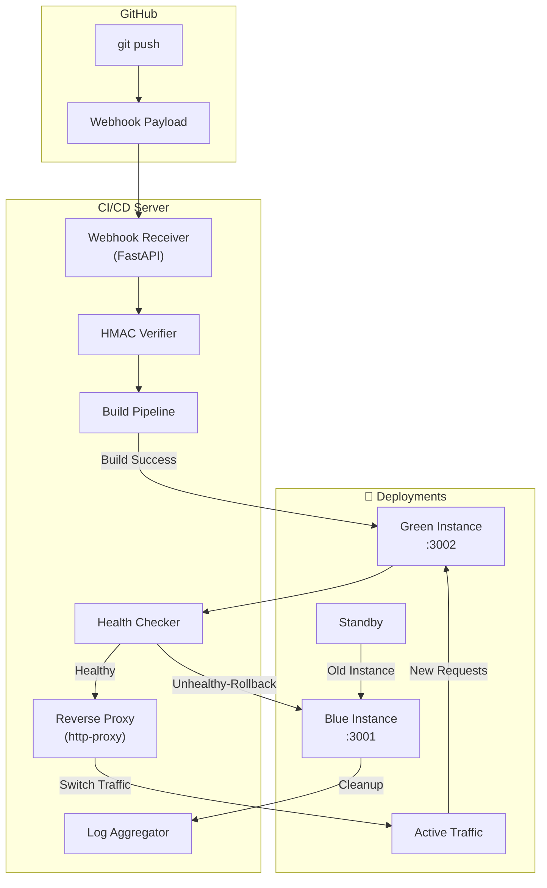

<div align="center">

# Mini Self-Hosted CI/CD Platform
**A lightweight, self-hosted CI/CD platform for Next.js applications with zero-downtime deployments.**
</div>

## Overview

Mini CI/CD is a **lightweight, self-hosted continuous integration and deployment platform**. It eliminates the need for external CI/CD services while giving you complete control and visibility over every stage of your deployment pipeline.

### Core Philosophy

- **Self-hosted**: Your code, your infrastructure, your rules
- **Zero-downtime**: Seamless deployments with automatic traffic switching
- **Transparent**: Understand every stage of the deployment pipeline
- **Automatic**: Deploy on every push with intelligent health checks and rollback

### Workflow
```
Git Push → GitHub Webhook → Verify Signature → Clone/Pull
    → Install Dependencies → Run Tests → Build Project
    → Start New Deployment → Health Check → Switch Traffic → Cleanup
```
---

## Features

### MVP (Current)
| Feature | Status | Description |
|---------|--------|-------------|
| GitHub Webhook Receiver | ✅ | Listen for push events from GitHub |
| HMAC Signature Verification | ✅ | Secure webhook payload validation |
| Auto Repository Update | ❌ | Clone or pull latest changes |
| Dependency Installation | ❌ | Automatic `npm install` |
| Test Execution | ❌ | Run test suites before deployment |
| Project Build | ❌ | Build Next.js applications |
| Concurrent Deployment Prevention | ❌ | Lock-based deployment safety |
| Blue-Green Deployment | ❌ | Zero-downtime traffic switching |
| Rolling Deployments | ❌ | Gradual traffic shifting |
| Custom Reverse Proxy | ❌ | Intelligent request routing |
| Health Checks | ❌ | Automated deployment validation |
| Automatic Rollback | ❌ | Instant recovery on failure |
| Deployment Logs | ❌ | Real-time log streaming |

### Out of Scope
- Kubernetes orchestration
- Docker containerization
- Multi-server deployments
- Cloud provider integrations
- User authentication/authorization
- Visual CI workflow editor
---

## Architecture


### Component Breakdown
| Component | Technology | Responsibility |
|-----------|-----------|----------------|
| **Webhook Server** | FastAPI | Receive and validate GitHub webhooks |
| **Build Engine** | Node.js child_process | Execute build pipeline steps |
| **Reverse Proxy** | http-proxy | Route traffic between deployments |
| **Process Manager** | Custom Script| Manage application instances |
| **Log Store** | JSON files | Persist deployment logs and metadata |
---

## Tech Stack
### Core
- **Runtime**: Node.js
- **Language**: TypeScript
- **Framework**: ExpressJS (for deployed apps)
- **Proxy**: http-proxy (Node.js)
### DevOps
- **Process Management**: child_process
- **Git Provider**: GitHub (via Webhooks)
- **Storage**: JSON file-based (initial phase)
### Deployment Targets
- **Strategy**: Blue-Green (MVP) → Rolling
---
## License
This project is licensed under the MIT License - see the [LICENSE](LICENSE) file for details.
---

<div align="center">

**Built with ❤️ for developers who want control over their deployment pipeline.**

[⭐ Star this repo](https://github.com/sahay-aaditya-raj/ci-cdPipeline) • [🐛 Report Bug](https://github.com/sahay-aaditya-raj/ci-cdPipeline/issues) • [💡 Request Feature](https://github.com/sahay-aaditya-raj/ci-cdPipeline/issues)

</div>
